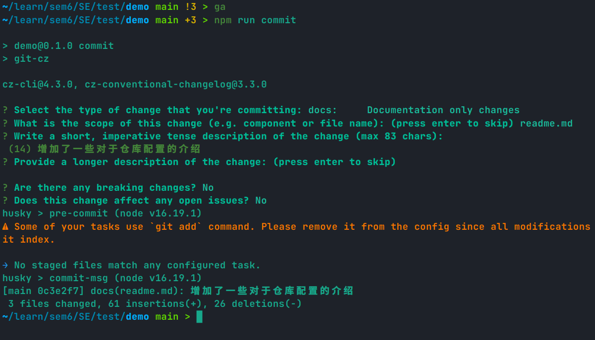
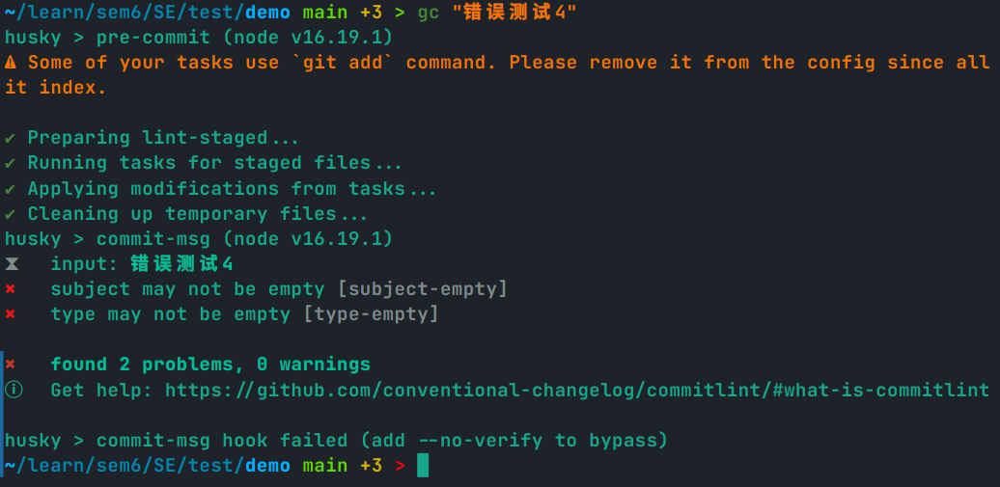

# demo

## 一、Project Operation

### 1.1 Vue + Electron 

此项目是 `vue + electron` 框架，使用如下命令建立

```shell
vue create demo
cd demo
vue add electron-builder
```

可以利用如下命令实现构建并运行：

```shell
npm run electron:serve
```

### 1.2 Code Style

使用 `eslint` 控制代码风格，首先按照 `eslint` 在开发环境依赖中，并进行初始化。其中代码风格为 `eslint-config-standard` ，其介绍文档在这里：https://github.com/standard/standard/blob/master/docs/README-zhcn.md

```shell
npm i -D eslint
./node_modules/.bin/eslint --init
```

然后 `package.json` 中补充脚本方便格式化，格式化对象包括 `js, vue`。同时除了检测码风问题外，还通过 `--fix` 对代码风格进行自动修复。 

```json
// package.json
{
    "scripts" : {
        "eslint": "eslint \"./src/**.{js,vue}\" --fix",
    }
}
```

在 `vscode` 中安装 `ESLint` 插件，并通过 `./.vscode/settings.json` 进行配置，使其可以保存是自动格式化。

```json
// settings.json
{
    "eslint.format.enable": true,
    "editor.codeActionsOnSave": {
        "source.fixAll.eslint": true
    }
}
```

此外还需设置 `tab` 的大小为两个空格，最终设置如下

```json
{
    "eslint.format.enable": true,
    "editor.codeActionsOnSave": {
        "source.fixAll.eslint": true
    },
    "editor.detectIndentation": true,
    "editor.insertSpaces": true,
    "editor.tabSize": 2,
}
```

### 1.3 Git Commit Style

利用 `commitizen cz-conventional-changelog` 进行 `commit` 信息的管理

```shell
npm i -D commitizen cz-conventional-changelog
```

此时需要利用如下命令进行 `commit` 

```shell
npm run commit
```

为了达到这个目的，需要在 `pakage.json` 中进行如下配置

```json
// package.json
{
    "scripts" : {
        "commit": "git-cz",
    }
}
```

在进行 `commit` 时，应当至少填写 `type, tense description` 。

最终效果如下：



另外还有一个东西被称作 `standard-version` 可以根据 `git commit` 的信息生成 `CHANGELOG.md` ，但是我没有找到他生成的文档在哪里，十分遗憾（哲哥救救）。

安装如下：

```shell
npm i -D standard-version
```

同样可以在脚本中进行补充，使其可以在输入 `npm run version` 时工作

```json
 // package.json
{    
    "scripts" : {        
        "version": "standard-version",
    }
}
```

### 1.4 Hook

在项目管理中，可以针对一些特定的项目事件设置钩子函数，在事件发生时触发钩子函数。我们实现钩子利用的是 `husky` 包

```
npm i -D husky
```

#### 1.4.1 提交前格式化

在 `package.json` 中添加如下内容，可以保证每次都在提交前进行格式化：

```json
"husky": {
    "hooks": {
        "pre-commit": "lint-staged",
    }
},
"lint-staged": {
    "*.{js,vue}": [
        "eslint --fix",
        "git add"
    ]
},
```

#### 1.4.2 检验 commit 信息

安装 `commitlint` 包用于检测 `commit` 信息的规格

```shell
npm i -D @commitlint/{config-conventional,cli}
```

同样需要设置 `husky`

```json
"husky": {
    "hooks": {
        "commit-msg": "commitlint -E HUSKY_GIT_PARAMS"
    }
},
```

还需要有一个配置文件为 `./commitlint.config.js`，内容如下

```js
module.exports = {
  extends: ['@commitlint/config-conventional']
}
```

此时基本上非 `npm run commit` 的信息都无法提交。效果如图



